# 📰 Телеграм бот: Новостной агрегатор
Данный бот является агрегатором новостей, а также имеет функцию рассылки новых новостей из необходимых источников.
## ✨ Возможности
* Просмотр новостей за определенное время из выбранного источника
* Просмотр новостей за определенное время из источника по умолчанию
* Подписка на любимые источники
* Выбор источника по умолчанию
* Выбор количества отображаемых новостей на одной странице
## 📋 Доступные источники
* Bloomberg
* Коммерсантъ
* TheGuardian
* Interfax
## 🛠 Технологии
* Python
* Aiogram - Telegram Bot API
* SQLAlchemy + Alembic - ORM и миграции 
* Asyncpg - асинхронный драйвер PostgreSQL 
* Docker + Docker Compose - контейнеризация 
* Pydantic - валидация конфигурации
* BeautifulSoup4 - парсинг новостей
## Схема базы данных:
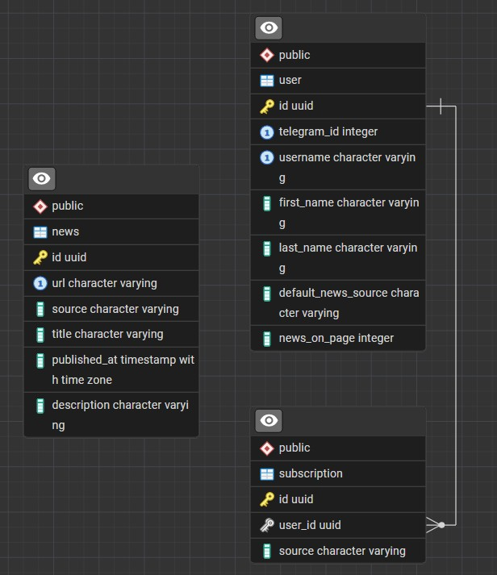
## 🚀 Быстрый старт
### Запуск без Docker:
1. Для начала необходимо склонировать проект:
```bash
git clone https://github.com/Fazzelis/news-for-traders-telegram-bot.git
```
2. Далее перейти в его папку:
```bash
cd news-for-traders-telegram-bot
```
3. Создать в папке с проектом .env файл, вот пример содержимого такого файла:

```
BOT_TOKEN="Ваш_токен_бота"
DATABASE_URL="postgresql+asyncpg://ваш_логин:ваш_пароль@ip_адрес:порт/название_базы_данных"
PROXY_URL="ip_адерес:порт"
```
Использование прокси необязательно, если без него не работает, запускайте через ваш прокси сервер
4. Установка зависимостей:
```
pip install -r requirements.txt
```
5. Применение миграций:
```
alembic upgrade head
```
6. Запуск бота:
```
python main.py
```
### Запуск через Docker:
1. Для начала необходимо склонировать проект:
```bash
git clone https://github.com/Fazzelis/news-for-traders-telegram-bot.git
```
2. Далее перейти в его папку:
```bash
cd news-for-traders-telegram-bot
```
3. Запустить docker-compose:
```
$env:PROXY_URL="ваш_адрес_прокси"; $env:BOT_TOKEN="ваш_токен_бота"; docker-compose up -d
```
Использование прокси необязательно, если без него не работает, запускайте через ваш прокси сервер
### Скриншоты работы бота:
Внешний вид бота:

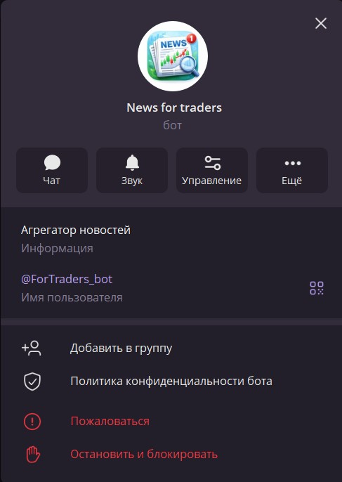

Начало работы с ботом:

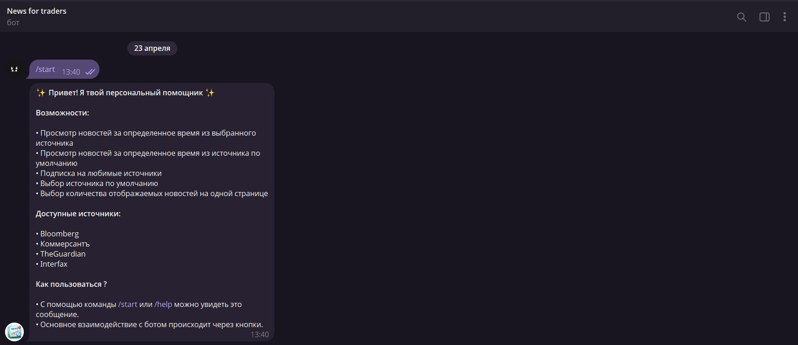

Кнопочная панель:

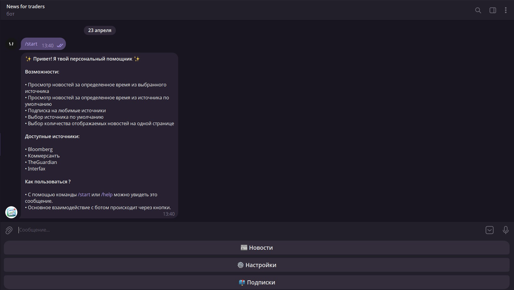

Меню настроек:

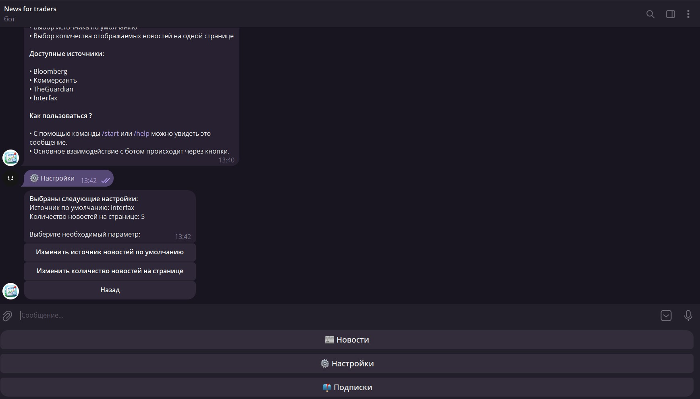

Выбор источника по умолчанию:

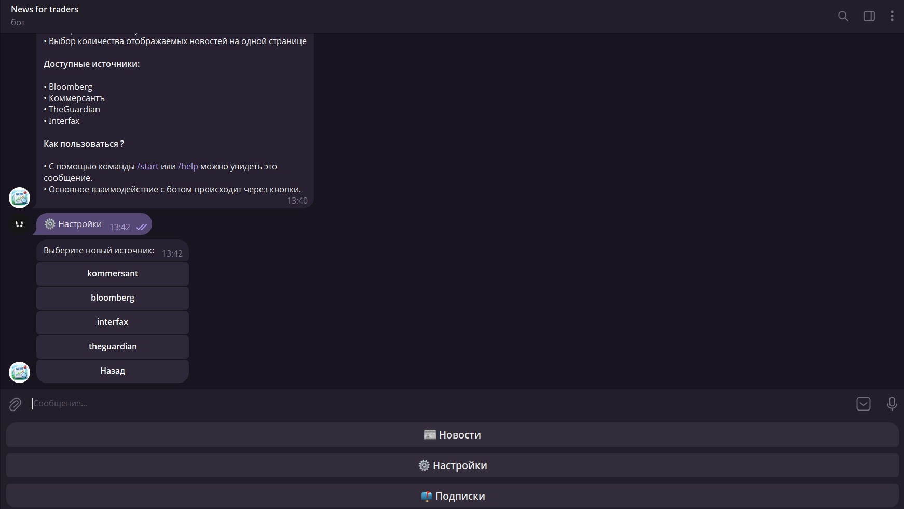

Выбор количества отображаемых новостей на одной странице:

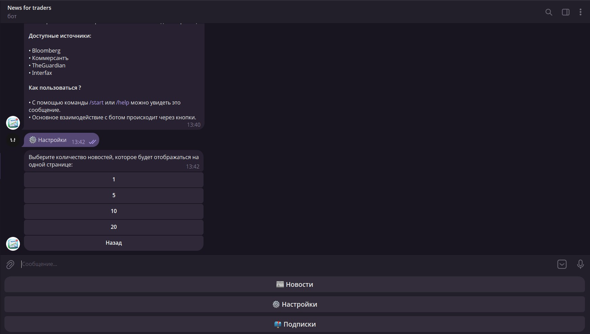

Меню подписок:

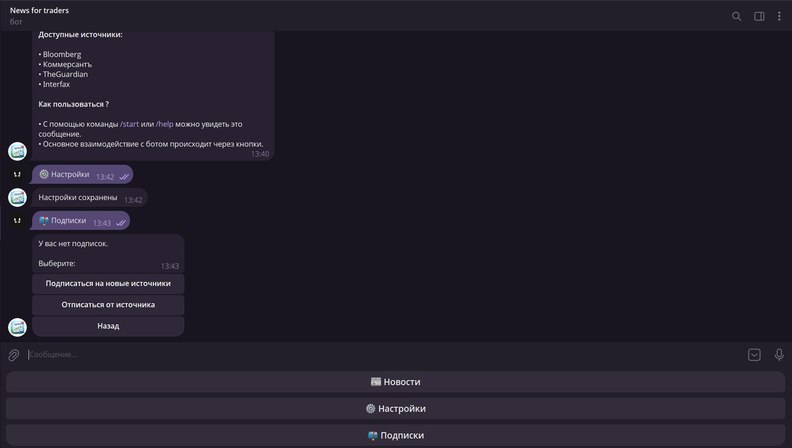

Выбор источника, на который можно подписаться:

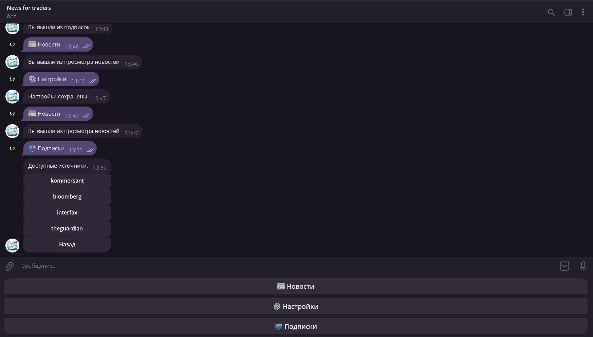

Пример меню подписок, когда есть источники, на которые подписан пользователь:

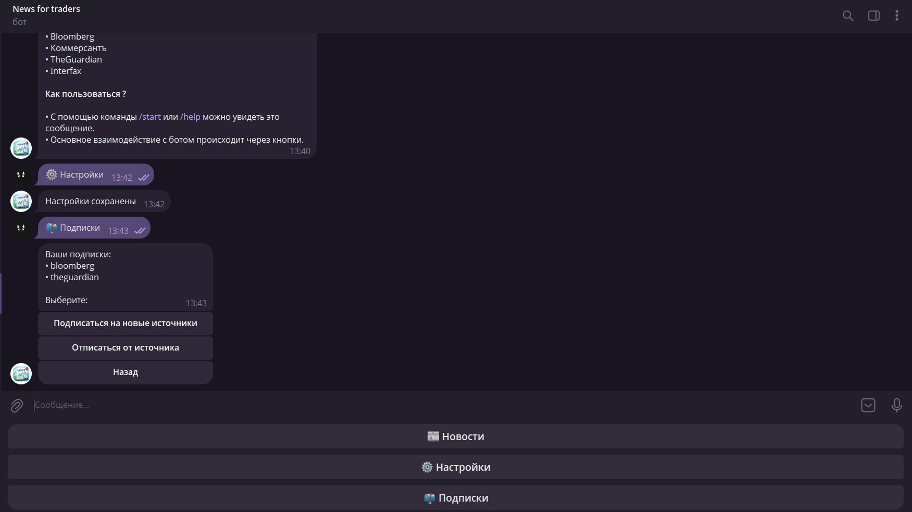

Меню "Отписаться от источника" выглядит также, как и меню "Подписаться на новые источники".

Меню просмотра новостей:

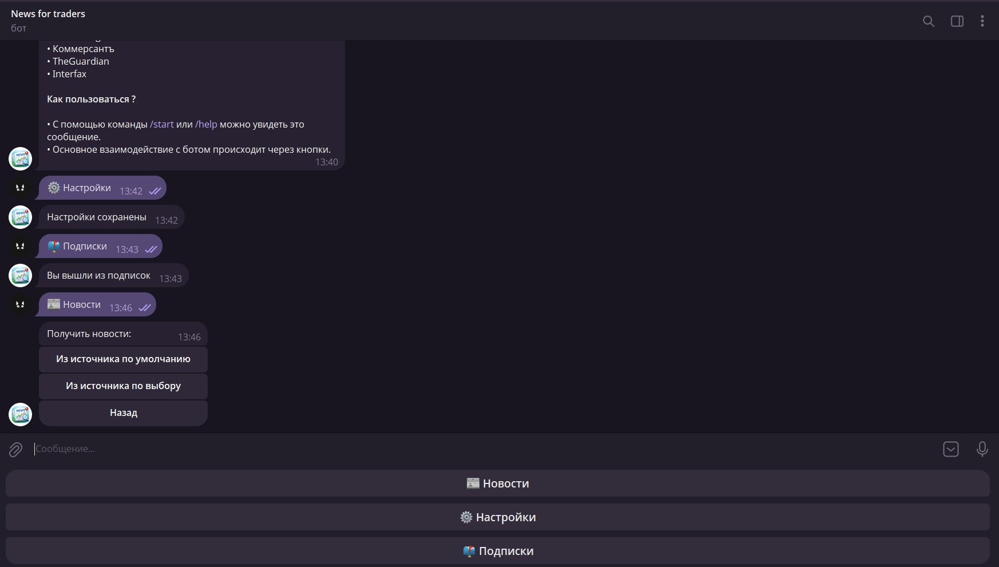

Меню при просмотре новостей из источника по умолчанию:

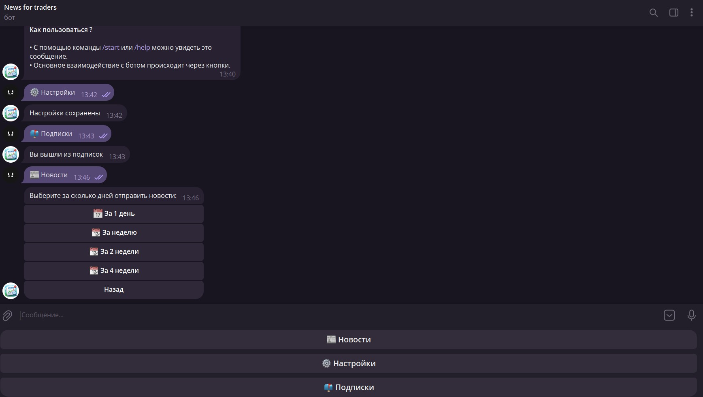

Просмотр новостей реализован с пагинацией:

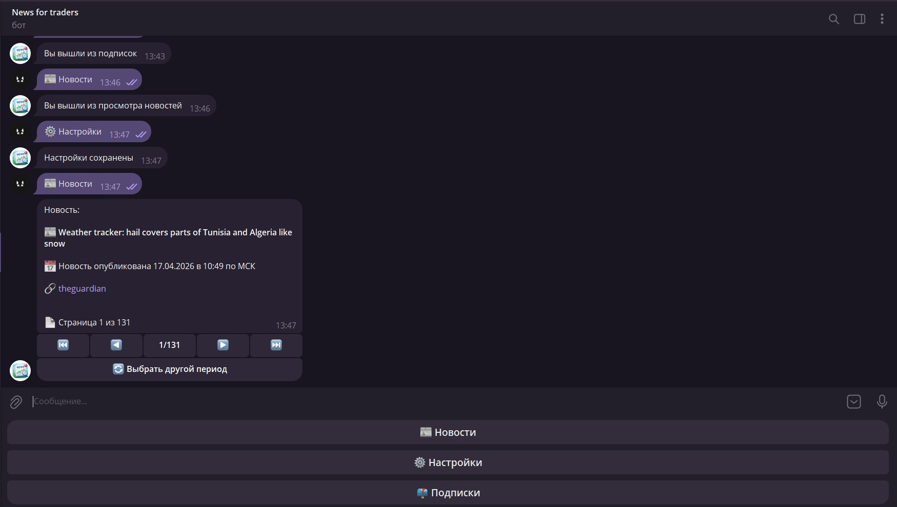

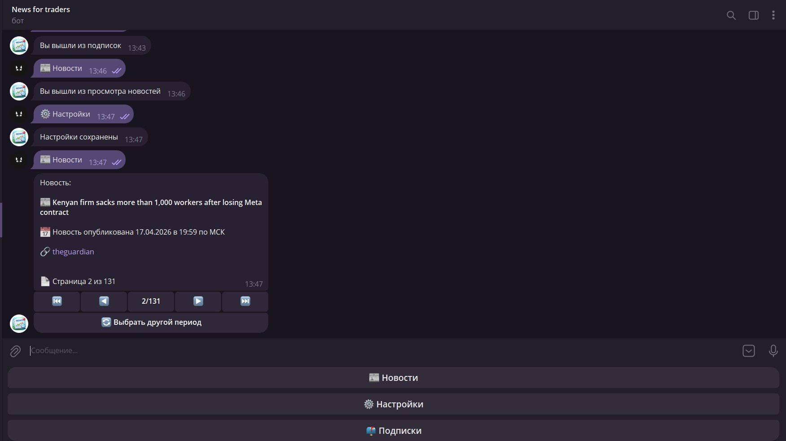

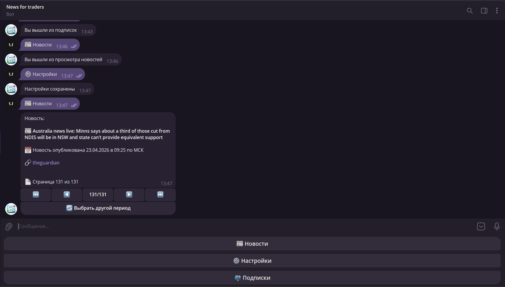

Меню при выборе источника:

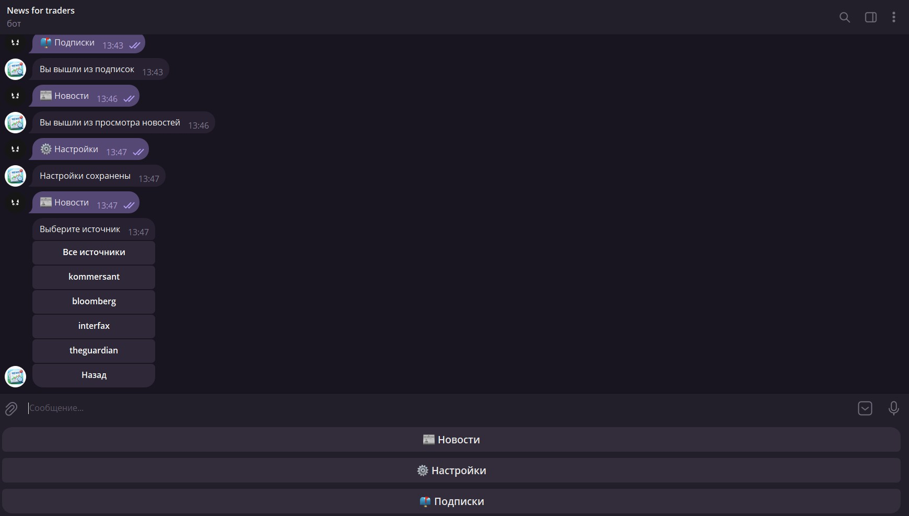

Далее откроется такой же выбор даты и меню просмотра новостей.

Рассылка выглядит следующим образом:

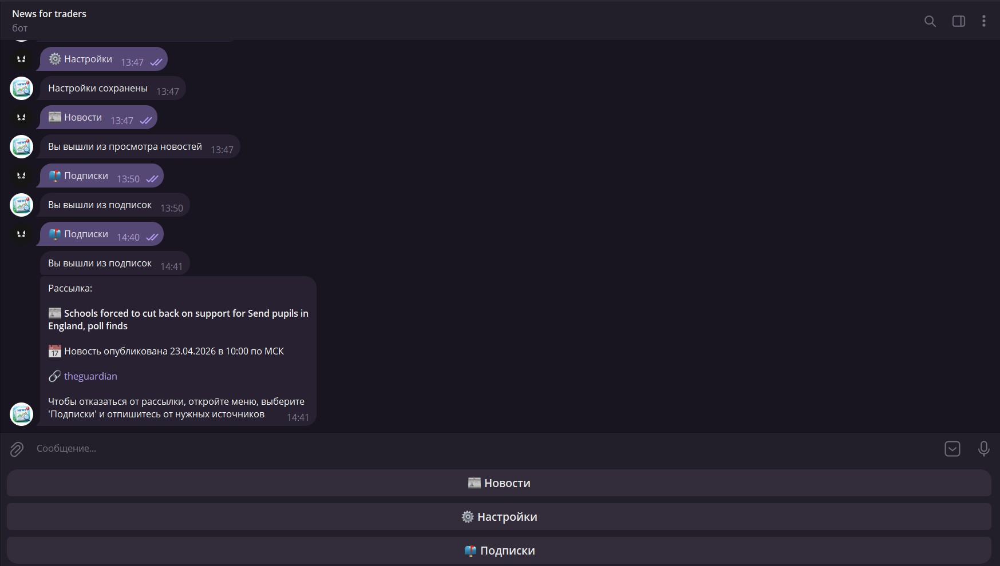